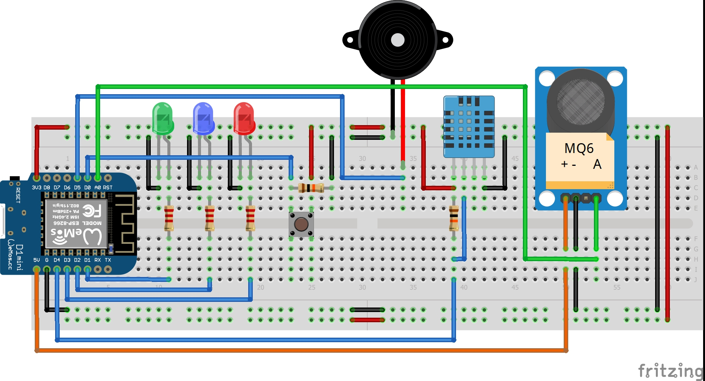
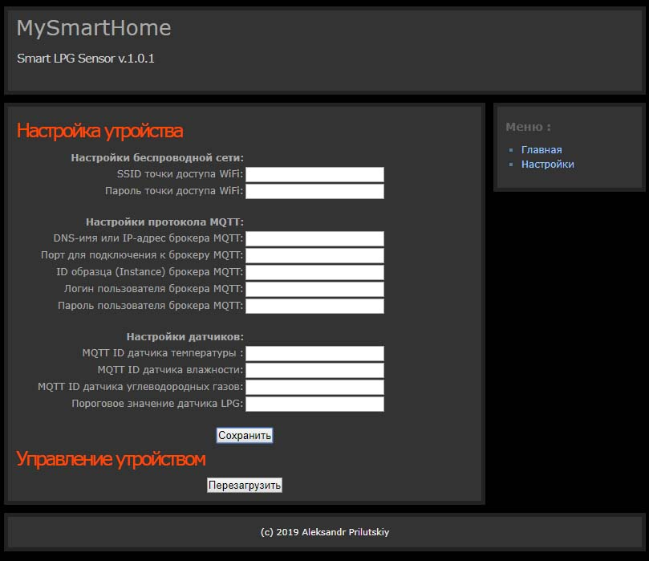

# SmartHome-SensorLPG
Блок датчика бытового газа для "Умного дома" 
 
Функции устройства: 
1. Чтение показаний датчика углеводородных газов и отправка их брокеру MQTT 
2. Чтение показаний датчика температуры и влажности и отправка их брокеру MQTT 
3. Сигнализация о превышении критического уровня углеводородных газов 
4. Контроль и настройка устройства через web-интерфейс 
5. Сброс настроек устройства при удержании специальной кнопк 
 
В папке <strong>Case</strong> - файлы под печать для копруса устройства. 
<h1>Схема</h1>
Аппаратные средства: 
- Контроллер <strong><a href="https://wiki.wemos.cc/products:d1:d1_mini">WeMos Di mini</a></strong> 
- Датчик углеводородных газов <strong>MQ-6</strong> 
- Датчик температуры и влажности <strong>DHT11</strong> 
 
Подключение <strong>WeMos Di mini</strong>: 
 pin D0 -> Reset Button 
 pin D1 -> Error LED (Red) 
 pin D2 -> Power LED (Green) 
 pin D3 -> WiFi LED (Blue) 
 pin D4 -> DHT11 (BuiltIn LED) 
 pin D5 -> Piezo buzzer 
 pin D6 -> NC 
 pin D7 -> NC 
 pin D8 -> NC 
 pin A0 -> MQ6 
 
 
Резисторы: 
- DHT11 и кнопrf = 10KOm 
- Светодиоды = 220Om..10KOm 
 
<h1>Инструкция</h1>
После прошивки контроллера должна появиться точка доступа "<strong>ESP8266WiFi</strong>", без пароля. 
Нужно подключиться к ней и зайти браузером по адресу <strong>192.168.0.1</strong> 
Ввести имя точки доступа и пароль. После сохранения устройство будет перезагружено и попытается подключиться к сети. 
Если при включения устройства удерживать кнопку (она единственная), будут сброшены настройки и необходимо заново подключиться к точке доступа "<strong>ESP8266WiFi</strong>" и ввести настройки. 
Для работы датчиков необходимо иметь учетную запись брокера MQTT, например <a href="https://www.cloudmqtt.com/">https://www.cloudmqtt.com/</a>.
 
